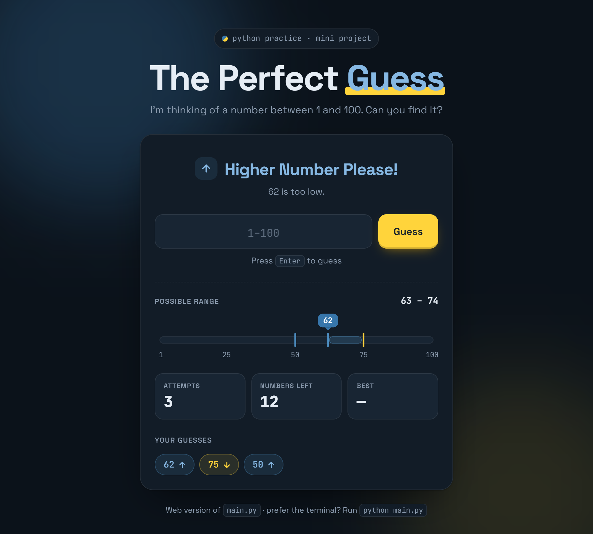

# 🎯 The Perfect Guess

A tiny number-guessing game written in Python, built as a **Python practice mini project**.

The computer secretly picks a number between **1 and 100**. You keep guessing, and after every guess it tells you to go **higher** or **lower** until you find it. At the end it tells you how many attempts you needed.



---

## 🐍 Why this project?

This repo is part of my Python learning journey. It isn't meant to be a big app. It's a small, complete program that uses the basics together:

- reading input from the user
- making decisions with `if` / `elif`
- repeating steps with a `while` loop
- keeping track of the game with variables

If you're learning Python too, it's a good project to read, run, break and improve.

## 📚 Python concepts practiced

| Concept | Where it's used in `main.py` |
| --- | --- |
| Importing a module | `import random` |
| Random numbers | `random.randint(1, 100)` picks the secret number (1 and 100 are both included) |
| Variables | `n` stores the secret number, `a` stores the latest guess |
| Counters | `guesses` keeps track of how many attempts you've made |
| `while` loop | `while(a != n):` keeps the game going until the guess is right |
| Input + type conversion | `int(input("Guess the number: "))` turns the typed text into a number |
| Comparison operators | `>`, `<` and `!=` compare the guess with the secret number |
| `if` / `elif` | chooses which hint to print |
| f-strings | `print(f"You have guessed the number {n} in ...")` puts variables inside text |

## ▶️ How to run

**Requirements:** Python 3.6 or newer (needed for f-strings). There are no extra packages; it only uses the standard library.

```bash
git clone https://github.com/zarishnasir123/Python_Mini_Project-The-Perfect-Guess.git
cd Python_Mini_Project-The-Perfect-Guess
python main.py
```

> On Windows, if `python` isn't recognised, try `py main.py`. On macOS/Linux you may need `python3 main.py`.

### Example game

```text
Guess the number: 50
Lower Number Please!
Guess the number: 25
Higher Number Please!
Guess the number: 37
Higher Number Please!
Guess the number: 43
You have guessed the number 43 in 4 attempts
```

## 🧠 How it works

1. **Pick a secret number.** `random.randint(1, 100)` returns a random whole number from 1 to 100 and stores it in `n`.
2. **Get the loop ready.** `a` starts at `-1`, a value that can never be the answer, so the `while` loop is guaranteed to run at least once.
3. **Ask for a guess.** `input()` always gives back text (a string), so `int()` converts it into a number that can be compared.
4. **Give a hint.** If the guess is bigger than `n`, print `Lower Number Please!`. If it's smaller, print `Higher Number Please!`.
5. **Repeat** until the guess is right. When `a == n`, the condition `a != n` becomes `False` and the loop stops.
6. **Show the result** using an f-string.

## 🌐 Bonus: play it in the browser

`index.html` is an animated web version of the same game, built with **React** and **Framer Motion**. It's an extra on top of the Python project, with the same rules and the same `Higher Number Please!` / `Lower Number Please!` hints.

**To play:** open `index.html` in your browser (double-click it). There's nothing to install. React and Framer Motion load from a CDN, so you need an internet connection.

What the web version adds:

- Hints that slide **up** for "higher" and **down** for "lower"
- A 1–100 range bar that shrinks as you close in on the answer
- Your guess history, an attempts counter and a "numbers left" counter
- Confetti when you win, plus a best score saved in your browser
- Input checks: letters, decimals, out-of-range numbers and repeated guesses are rejected (the Python version doesn't do this yet, see the challenges below)
- Light and dark mode, and a layout that works on phones

> The page respects your system's *reduce motion* setting. If the animations look minimal, animations may be turned off in your OS (on Windows: **Settings → Accessibility → Visual effects → Animation effects**).

## 📁 Project structure

```text
.
├── main.py           # the Python game (runs in the terminal)
├── index.html        # animated web version (React + Framer Motion)
├── assets/
│   └── preview.png   # screenshot used in this README
└── README.md
```

## 💪 Practice challenges

Want to keep practicing? Try adding these to `main.py`, roughly from easiest to hardest:

- [ ] **Handle bad input.** Typing `abc` crashes the game with a `ValueError`. Wrap `int(input(...))` in a `try` / `except` block.
- [ ] **Stay in range.** Reject guesses below 1 or above 100 without counting them as attempts.
- [ ] **Play again.** After a win, ask `Play again? (y/n)` and start a new round.
- [ ] **Limited lives.** Give the player 7 attempts. If they run out, reveal the number.
- [ ] **Difficulty levels.** Easy (1–10), Medium (1–100), Hard (1–1000).
- [ ] **High score.** Save the best score to a file like `hiscore.txt` with `open()`. Good practice for file handling.
- [ ] **Use functions.** Move the game into a `play_game()` function and call it inside `if __name__ == "__main__":`.
- [ ] **Swap roles.** You think of a number and the computer guesses it using binary search.

## 💡 The "perfect" strategy

Always guess the **middle** of the numbers that are still possible: start with 50, then 25 or 75, and so on. Each guess cuts the possibilities in half. This is called **binary search**. With 100 numbers you never need more than **7 guesses**, because 2⁷ = 128, which is more than 100.

## 🛠️ Built with

- **Python 3** (standard library only: `random`)
- **Web version:** React 18 + Framer Motion 11, loaded from a CDN

---

Made by Zarish Nasir while practicing Python. Feel free to fork it and try the challenges yourself!
